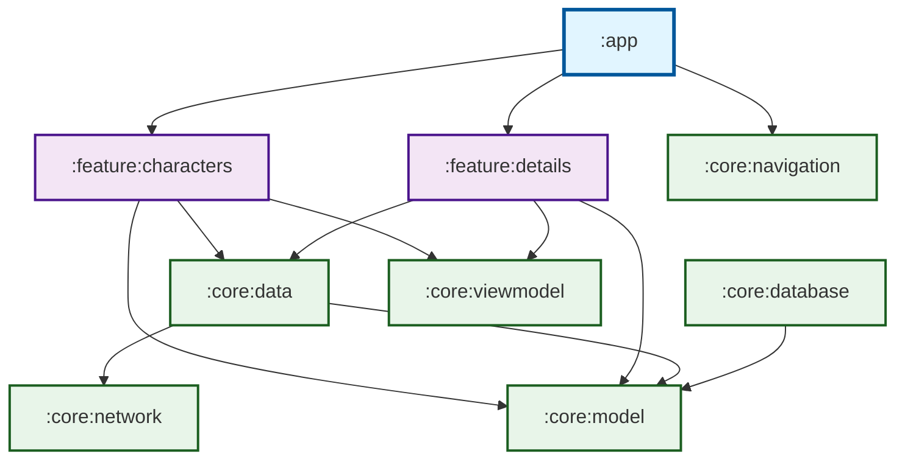

# Harry Potter Android App

해리포터 시리즈의 캐릭터 정보를 탐색할 수 있는 Android 애플리케이션입니다.

## 📱 앱 소개

이 앱은 [Harry Potter API](https://hp-api.onrender.com/)를 활용하여 해리포터 시리즈에 등장하는 다양한 캐릭터들의 정보를 제공합니다.

### 주요 기능

- **캐릭터 목록**: 해리포터 세계의 모든 캐릭터를 목록으로 확인
- **상세 정보**: 각 캐릭터의 세부 정보 조회

## 🏗️ 아키텍처

이 프로젝트는 **멀티 모듈 아키텍처**를 채택하여 Clean Architecture 원칙을 따릅니다.

### 기술 스택

- **UI**: Jetpack Compose, Material3
- **Architecture**: MVVM + MVI (Orbit)
- **DI**: Koin
- **Network**: Retrofit, OkHttp, Kotlin Serialization
- **Database**: Room
- **Image Loading**: Coil
- **Navigation**: Jetpack Navigation Compose
- **Async**: Kotlin Coroutines
- **Logging**: Timber

## 📊 모듈 의존성 다이어그램

### 모듈 설명

#### App Module
- **:app**: 애플리케이션 진입점 및 DI 설정

#### Feature Modules
- **:feature:characters**: 캐릭터 목록 화면
- **:feature:details**: 캐릭터 상세 정보 화면

#### Core Modules
- **:core:data**: Repository 패턴 구현 및 데이터 소스 통합
- **:core:network**: Retrofit API 서비스 및 네트워크 설정
- **:core:database**: Room 데이터베이스 및 DAO
- **:core:model**: 도메인 모델 정의
- **:core:viewmodel**: BaseViewModel 및 공통 ViewModel 로직
- **:core:navigation**: 화면 네비게이션 정의

## 🚀 시작하기

### 요구사항

- Android Studio Hedgehog (2023.1.1) 이상
- JDK 17
- Android SDK 34
- Kotlin 2.0.21
